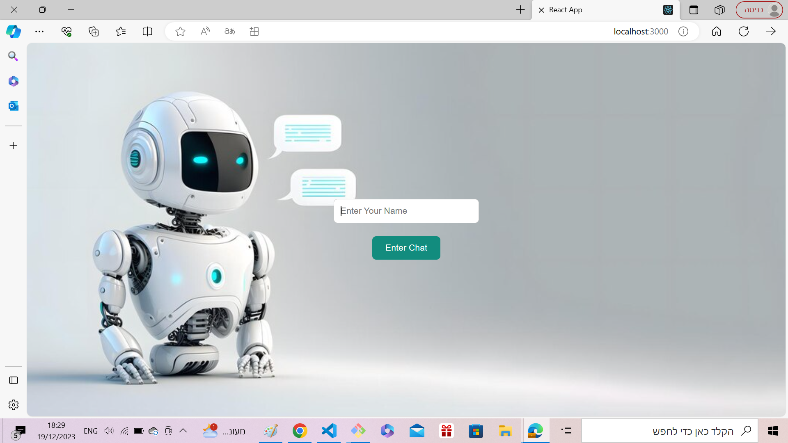
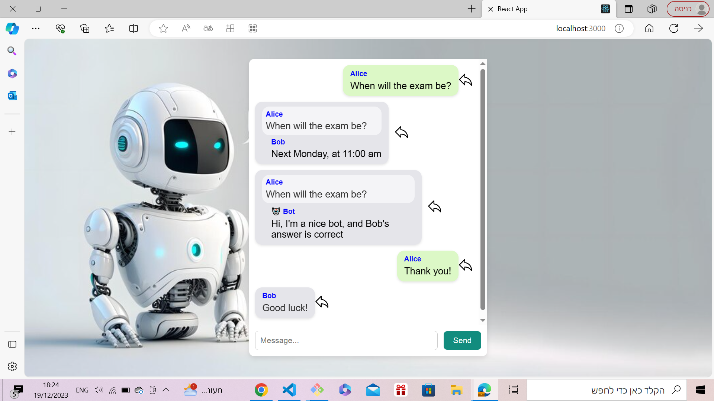
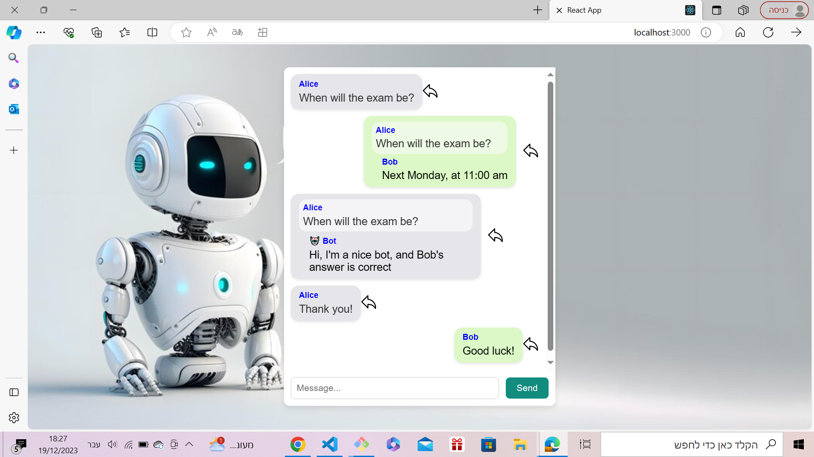

# Chat Room with Bot

## How to Run?
1. Run `cd server`.
2. Run `npm install`.
3. Run `node index.js` then the server will run on port 3002.
4. In a different tab run `cd client`.
5. Run `npm install`.
6. Run `npm start`, open [http://localhost:3000](http://localhost:3000) to view it in your browser.

- To send a meesage, write the message and click send.
- To reply to a message, click the arrow near the message you want to reply to, (the arrow will turn from white to black), then write your reply and click send.
- A bot will also answer questions that have already been answered before.

